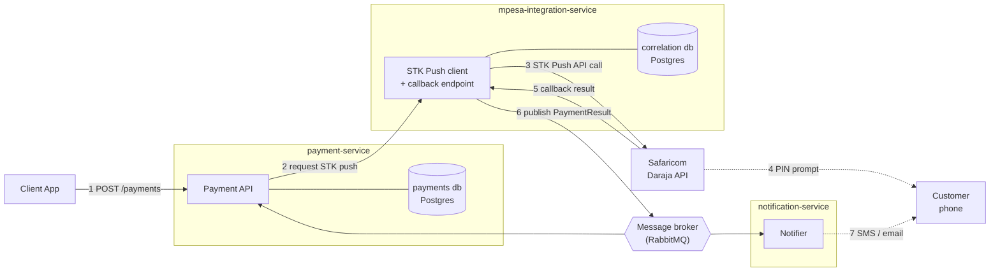
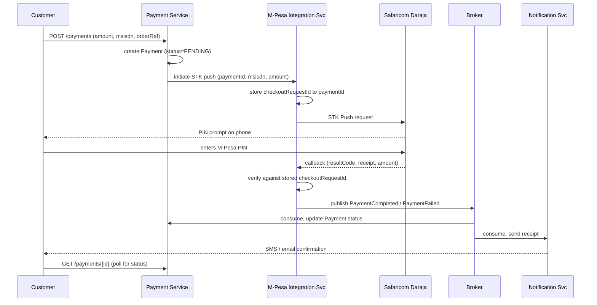

# STK Push Payment Architecture

A multi-service design for accepting M-Pesa payments: Spring Boot services, PostgreSQL per service, and an async boundary around Safaricom's Daraja API so a slow or missing callback never blocks the customer-facing path.

## 1. Why three services

The STK Push flow has three concerns that fail independently and change at different rates: taking a payment request, talking to Safaricom's quirks, and telling the customer what happened. Splitting them means a Daraja outage or credential rotation touches one deployable, not your whole checkout path.

- **Payment Service** — the system of record. Owns the payment lifecycle, exposes the API your client app calls, never talks to Daraja directly.
- **M-Pesa Integration Service** — the only service that holds Daraja credentials, builds STK Push requests, and exposes the public callback URL Safaricom calls back on.
- **Notification Service** — sends the SMS/email receipt once an outcome is known. Dumb on purpose: one job, no payment logic.

## 2. Component map

Client and notification are the only parts the customer ever sees or hears from.

## 3. Request sequence

Everything after step 5 is async — the client polls or gets pushed the result, it never blocks on Daraja.

## 4. Service responsibilities

| Service | Owns | Talks to |
|---|---|---|
| `payment-service` | Payment lifecycle, order linkage, public REST API, status queries | Client app, broker, its own Postgres |
| `mpesa-integration-service` | Daraja OAuth token, STK Push calls, the callback endpoint, reconciliation job | Daraja API, broker, its own Postgres |
| `notification-service` | Outcome messaging only — no payment state | Broker, SMS/email provider |

Each service keeps its own database — `payment-service` never queries `mpesa-integration-service`'s tables directly. They only share state through published events.

## 5. Core data

### Payment (`payment-service`)

| Field | Type | Notes |
|---|---|---|
| `id` | UUID | primary key, external-facing |
| `orderReference` | string | links back to whatever the customer was buying |
| `msisdn` | string | 254-format phone number |
| `amount` | decimal | KES, matched against the callback amount |
| `status` | enum | `PENDING` · `COMPLETED` · `FAILED` · `TIMED_OUT` |
| `mpesaReceiptNumber` | string | set only on `COMPLETED` |
| `createdAt` / `updatedAt` | timestamp | drives the reconciliation window |

### StkCorrelation (`mpesa-integration-service`)

| Field | Type | Notes |
|---|---|---|
| `checkoutRequestId` | string | Daraja's ID — the only thing the callback carries reliably |
| `paymentId` | UUID | foreign reference, not a foreign key across services |
| `requestedAt` | timestamp | used to decide when to poll transaction status |

## 6. What breaks if you skip these

> **No callback ever arrives.** Safaricom's callback delivery isn't guaranteed. Give `mpesa-integration-service` a scheduled job that queries the Transaction Status API for any correlation still unresolved ~60s after the push, so a payment can't stay `PENDING` forever.

- **Idempotent callbacks** — Safaricom can retry the callback. Key on `checkoutRequestId` and make the handler a no-op on a second delivery.
- **Don't trust the callback amount blindly** — compare it against the amount stored at STK-push time before marking a payment complete.
- **Secrets stay in one place** — consumer key/secret, passkey, and initiator credentials live only in `mpesa-integration-service`'s config/vault, never in `payment-service`.
- **Retries on the push call are asymmetric** — a timeout talking to Daraja doesn't mean the push didn't fire; don't blindly retry without checking status first.

## 7. Build order

1. **payment-service** — API, Payment entity, Postgres, a stub that fakes an STK response so the customer-facing path works end to end first.
2. **mpesa-integration-service** — real Daraja sandbox integration behind the same interface the stub used; wire the callback endpoint.
3. **Broker** — drop in RabbitMQ once both services work over direct REST calls; don't start with the broker, add it when you feel the coupling.
4. **notification-service** — last, since nothing else depends on it.
5. **Reconciliation job** — add once the happy path and the callback path both work; this is what makes `PENDING` payments trustworthy.

---

Daraja sandbox docs: `developer.safaricom.co.ke` · target stack: Spring Boot, Maven, PostgreSQL, RabbitMQ
